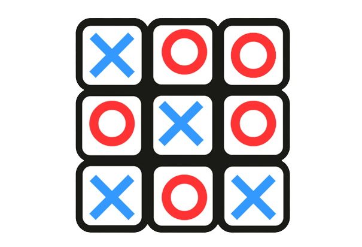

# Tic-Tac-Toe with Minimax A.I.

<p float="left">
  
   
</p>

___ 

### **Demo Video**:  
[>>> Link](https://youtu.be/khioWr3C7X0)

___


### **Project Description**:
Welcome to my **CS50P (CS50’s Introduction to Programming with Python)** [final project](https://cs50.harvard.edu/python/2022/project/)!
I implemented a single-player `Tic-Tac-Toe` game playing against the computer. This computer uses the minimax (a type of adversarial search) algorithm to compute the best possible move against its opponent (the user). 

Tic-tac-toe can be fun by itself — with a random A.I. —, however I felt a challenge was necessary for the enjoyment of the player. I find it very interesting that such a simple game can turn so labyrinthine.

I chose this project, for it encompasses the necessary fundamentals and concepts used in Python. This delineates: loops, control-flow, functions, algorithms, computational-thinking, etc... 

Most importantly, this project was fun! 😀

___

### **What is Tic-Tac-Toe?**:
For those that do not know how to play tic-tac-toe:

Tic-tac-toe is a two player game where each player chooses either a X or an O to represent their marker.
The tic-tac-toe board is a 3x3 grid.
1. A turn begins when a player will place his/her marker on an empty spot on the grid.
2. The next player will play his/her turn.
3. Players will keep alternating turns until either:
    - a player's marker has consecutively filled 3 spots horizontally/vertically/diagonally (a **win**)
    - the board is filled with markers with no win
  
That's it! 👏

___

### **Setup**:
How to play my Tic-Tac-Toe:
```bash
# Run the main project.py file
python project.py
```

___
### **Thank you**:
I want to thank **Professor Malan** and everyone who is on the **CS50P** team! I have had a deep passion for computer science every since I began the course; it is absolutely incredible that such resources are available online for anyone to learn. Harvard University is truly doing something remarkable for everyone across the globe, with their free open source courses. Thank you for this opportunity.
<br></br>
\- Adi Patel